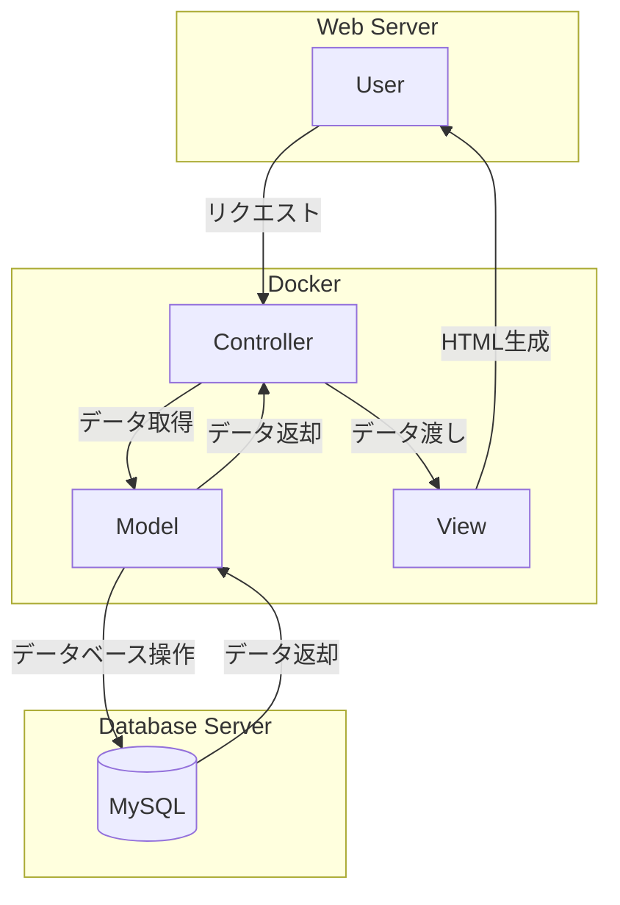

# ShuffleLunch

## 概要
ShuffleLunchは、ランダムにランチのメンバーをシャッフルしてペアリングするためのアプリケーションです。社員同士の交流を促進し、新しい人との出会いを支援します。

## 特徴
- ランダムなペアリング機能
- メンバーの管理機能
- ランチのスケジュール管理
- シンプルで直感的なユーザーインターフェース

## このプロジェクトを通して学べること・習得できること
- PHPとMySQLを使用したWebアプリケーションの開発
- Dockerを使用した開発環境の構築
- MVCアーキテクチャの理解と実践
- フロントエンドとバックエンドの連携


## 必要条件
- Docker
- Docker Compose

## インストール手順
1. リポジトリをクローンします:
    ```bash
    git clone https://github.com/ksk-aiko/shuffleLunch.git
    cd shuffleLunch
    ```
2. Dockerイメージをビルドします:
    ```bash
    docker-compose build
    ```
3. Dockerコンテナを起動します:
    ```bash
    docker-compose up -d
    ```

## 使用方法
1. ブラウザで `http://localhost:8080` にアクセスします。
2. メンバーを登録し、シャッフルボタンをクリックしてランチのペアリングを行います。

## 機能一覧
- メンバーのランダムペアリング
- メンバーの追加・削除
- ランチスケジュールの管理

## 技術スタック
- PHP 8
- MySQL
- Docker
- Apache
- Composer

## 追加資料
- [クラス図](src/diagrams/class.pu)
- [シーケンス図](src/diagrams/sequence.pu)
- [コンポーネント図](src/diagrams/component.pu)
- [アーキテクチャ図](src/diagrams/arch.pu)

## 貢献方法
1. このリポジトリをフォークします。
2. 新しいブランチを作成します:
    ```bash
    git checkout -b feature/your-feature-name
    ```
3. 変更をコミットします:
    ```bash
    git commit -m 'Add some feature'
    ```
4. ブランチにプッシュします:
    ```bash
    git push origin feature/your-feature-name
    ```
5. プルリクエストを作成します。

## ライセンス
このプロジェクトはMITライセンスの下でライセンスされています。