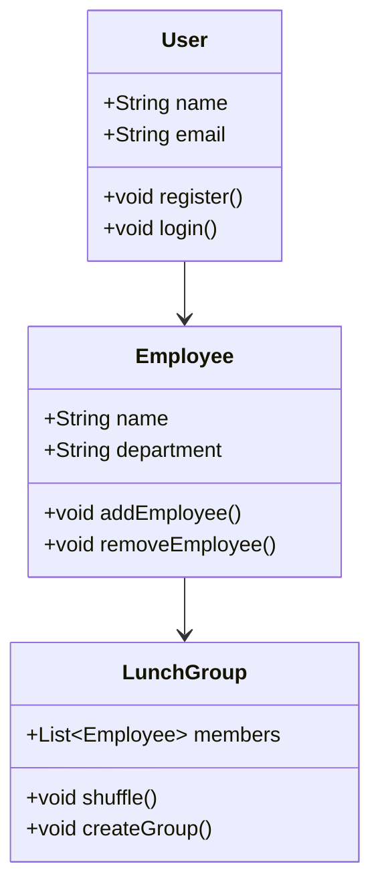
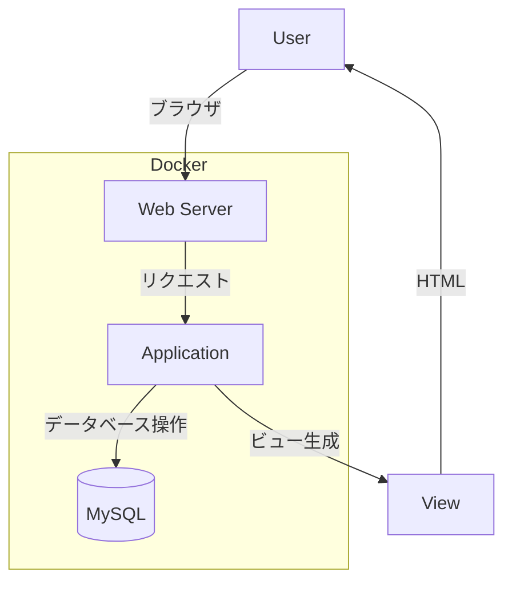
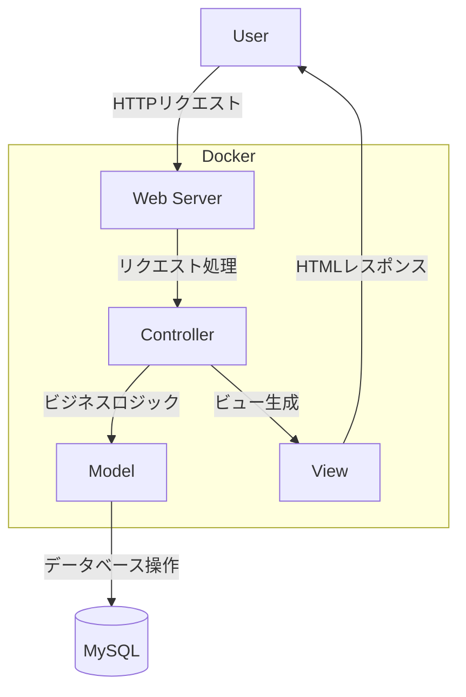
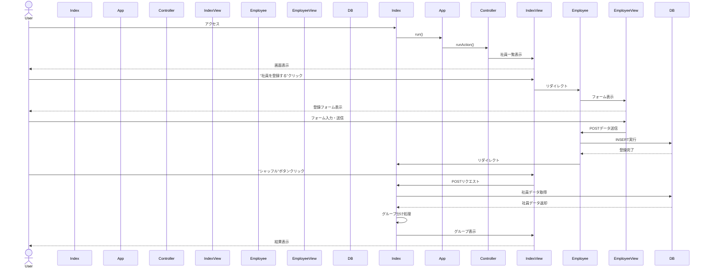

# ShuffleLunch Diagrams

## クラス図

```mermaid
classDiagram
    class User {
        +String name
        +String email
        +void register()
        +void login()
    }

    class Employee {
        +String name
        +String department
        +void addEmployee()
        +void removeEmployee()
    }

    class LunchGroup {
        +List~Employee~ members
        +void shuffle()
        +void createGroup()
    }

    User --> Employee
    Employee --> LunchGroup
```

## コンポーネント図

```mermaid
        graph TD
        A[User] -->|ブラウザ| B[Web Server]
        B -->|リクエスト| C[Application]
        C -->|データベース操作| D[(MySQL)]
        C -->|ビュー生成| E[View]
        E -->|HTML| A

        subgraph Docker
            B
            C
            D
        end
```

## アーキテクチャ図

```mermaid
graph TD
    A[User] -->|HTTPリクエスト| B[Web Server]
    B -->|リクエスト処理| C[Controller]
    C -->|ビジネスロジック| D[Model]
    D -->|データベース操作| E[(MySQL)]
    C -->|ビュー生成| F[View]
    F -->|HTMLレスポンス| A

    subgraph Docker
        B
        C
        D
        F
    end
```
## シーケンス図

```mermaid
sequenceDiagram
    actor User
    participant "web/index.php" as Index
    participant "Application.php" as App
    participant "Controller.php" as Controller
    participant "views/index.php" as IndexView
    participant "employee.php" as Employee
    participant "views/employee.php" as EmployeeView
    participant "employees" as DB

    User ->> Index: アクセス
    Index ->> App: run()
    App ->> Controller: runAction()
    Controller ->> IndexView: 社員一覧表示
    IndexView -->> User: 画面表示

    User ->> IndexView: "社員を登録する"クリック
    IndexView ->> Employee: リダイレクト
    Employee ->> EmployeeView: フォーム表示
    EmployeeView -->> User: 登録フォーム表示

    User ->> EmployeeView: フォーム入力・送信
    EmployeeView ->> Employee: POSTデータ送信
    Employee ->> DB: INSERT実行
    DB -->> Employee: 登録完了
    Employee ->> Index: リダイレクト

    User ->> IndexView: "シャッフル"ボタンクリック
    IndexView ->> Index: POSTリクエスト
    Index ->> DB: 社員データ取得
    DB -->> Index: 社員データ返却
    Index ->> Index: グループ分け処理
    Index ->> IndexView: グループ表示
    IndexView -->> User: 結果表示
```